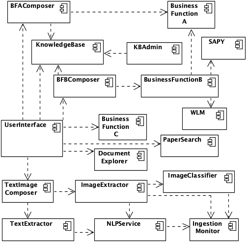
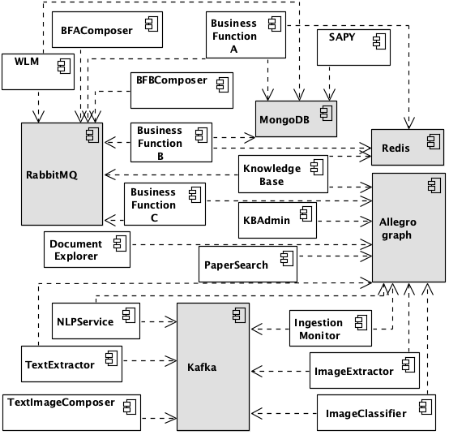

## ICWS'2020 Paper -- Extra Info

The figure below is snapshot from the end of 2019 of the software architecture of the
target scientific application.
 The notation is based on UML 2.0 deployment diagram, but it actually shows microservices (except for the User Interface,
  which is not a microservice and thus was excluded for this study). This figure shows the coupling among microservices.
   Note that the names of some microservices were omitted for the sake of confidentiality.

The figure below focuses on the dependencies on different types of storage (e.g., triplestore,
 NoSQL database, in-memory data store). All other dependencies (e.g., a microservice that depends on another microservice) were omitted.

